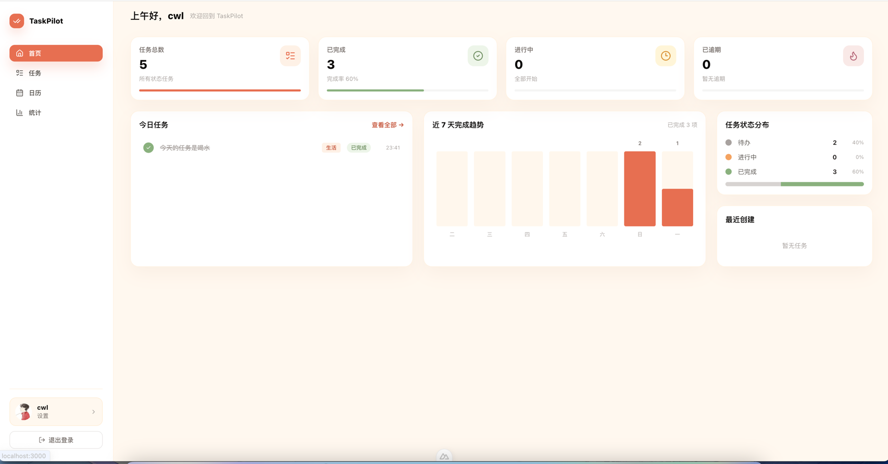
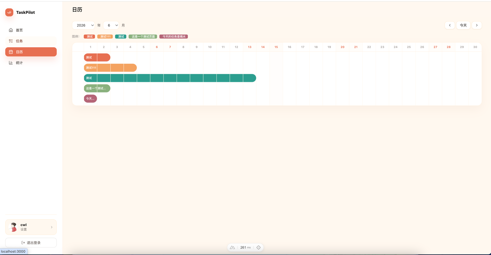
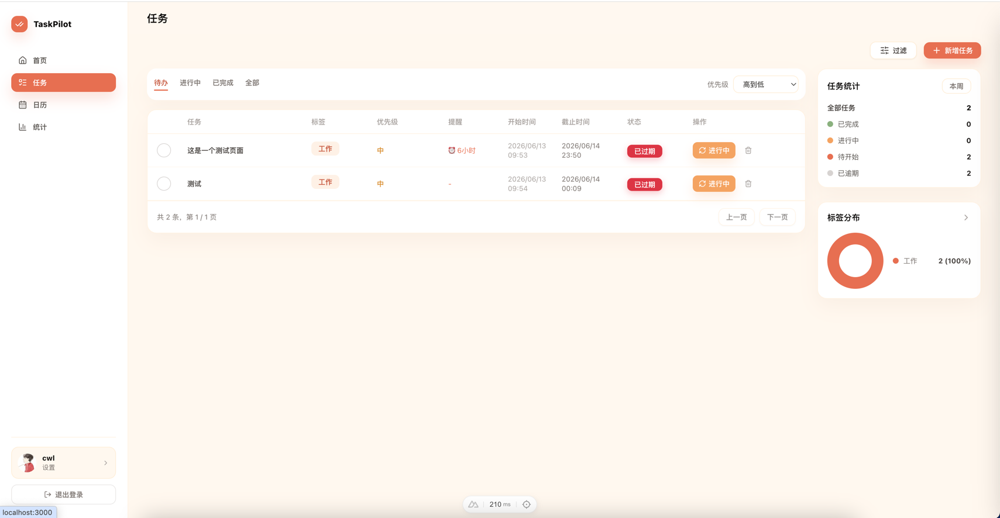
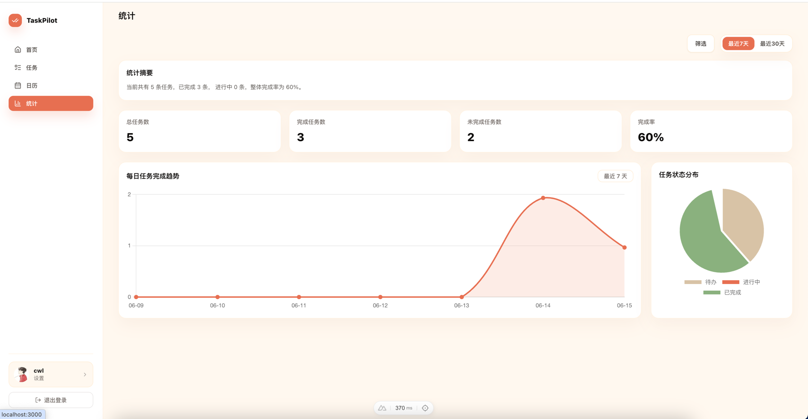
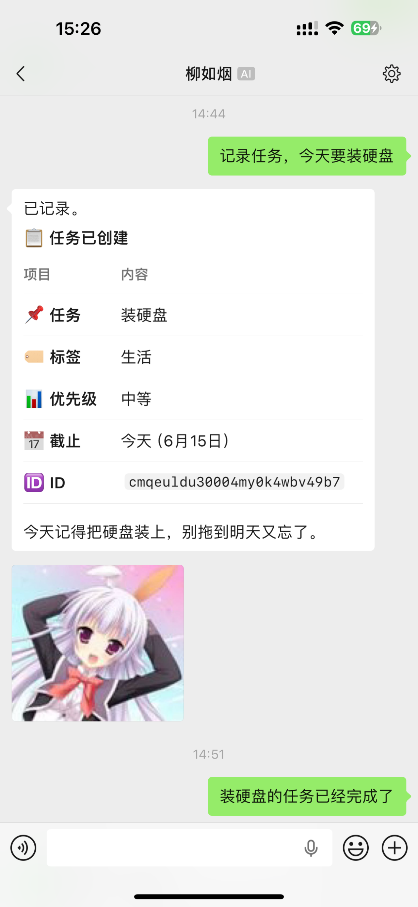

# TaskPilot

轻量级个人任务管理面板，支持任务 CRUD、日历甘特图、访问令牌鉴权、Webhook 提醒通知。

## 功能

| 模块 | 说明 |
|---|---|
| 任务管理 | 创建/编辑/删除任务，标签、优先级、开始/截止时间、提醒时间 |
| 日历视图 | 按月显示任务横条（甘特图），跨天跨度，彩色区分 |
| 访问令牌 | 生成 Bearer Token 替代密码访问 API，支持过期时间 |
| Webhook | 配置 POST 回调地址，任务到期自动推送通知 |
| 提醒调度 | 定时轮询到期任务，通过 Webhook 发送提醒消息 |
| 个人设置 | 头像上传、密码修改、令牌/Webhook/提醒配置 |

## 预览

<table>
  <tr>
    <td></td>
    <td></td>
  </tr>
  <tr>
    <td align="center">首页仪表盘</td>
    <td align="center">任务管理</td>
  </tr>
  <tr>
    <td></td>
    <td></td>
  </tr>
  <tr>
    <td align="center">
        
    </td>
  </tr>
</table>

## 技术栈

- [Nuxt 4](https://nuxt.com/) + Vue 3 + TypeScript
- [Prisma](https://www.prisma.io/) + SQLite
- [Tailwind CSS](https://tailwindcss.com/)
- [Pinia](https://pinia.vuejs.org/) 状态管理
- [Lucide](https://lucide.dev/) 图标

## 快速开始

```bash
# 安装依赖
npm install

# 初始化数据库（创建表 + 默认管理员）
npx prisma db push
npx prisma generate
sqlite3 prisma/dev.db < prisma/init.sql

# 启动开发服务器
npm run dev
```

启动后访问 `http://localhost:3000`。

### 默认账户

| 用户名 | 密码 | 备注 |
|---|---|---|
| admin | admin123 | 首次登录需重置密码 |

## 项目结构

```
TaskPilot/
├── app/                    # 前端（Nuxt）
│   ├── pages/              # 页面组件
│   │   ├── index.vue       # 首页仪表盘
│   │   ├── tasks.vue       # 任务管理
│   │   ├── calendar.vue    # 日历甘特图
│   │   ├── stats.vue       # 统计报表
│   │   └── settings.vue    # 个人设置
│   ├── components/         # 公共组件
│   ├── composables/        # 状态管理（Pinia stores）
│   └── types/              # TypeScript 类型
├── server/                 # 后端（Nitro）
│   ├── api/                # API 路由
│   │   ├── tasks/          # 任务 CRUD
│   │   ├── auth/           # 认证 + 访问令牌
│   │   ├── webhooks/       # Webhook 配置
│   │   ├── calendar/       # 日历数据
│   │   └── reminder-config/# 提醒设置
│   ├── middleware/         # 鉴权中间件
│   ├── plugins/            # 定时任务（提醒调度）
│   └── utils/              # 工具函数
├── prisma/
│   ├── schema.prisma       # 数据模型
│   └── init.sql            # 建表脚本
├── Dockerfile              # Docker 构建
├── docker-entrypoint.mjs   # 容器入口（初始化 DB + 启动）
└── .dockerignore
```

## API 鉴权

所有 `/api/` 请求需携带 `Authorization: Bearer <token>` 请求头。支持两种 Token：

1. **Session Token** — 登录后获取，默认 7 天有效
2. **Access Token** — 在设置页手动创建，可用于 CI/CD 等场景

## Docker 部署

### 从 Docker Hub 拉取（推荐）

```bash
docker pull cwlunuuc/taskpilot:latest
```

支持 `linux/amd64` 和 `linux/arm64`，自动匹配架构。

### 本地构建

```bash
docker build -t taskpilot .

# 运行容器（映射数据目录到宿主机）
docker run -d \
  -p 27896:3000 \
  -v /Users/cwl/Documents/docker-compose/taskPilot/prisma:/app/prisma \
  -v /Users/cwl/Documents/docker-compose/taskPilot/avatars:/app/data/avatars \
  --name taskpilot \
  taskpilot
```

> 宿主机端口 `27896` 和挂载目录可按需修改。首次启动自动初始化数据库并创建默认管理员。

首次启动自动初始化数据库并创建默认管理员。数据库和头像文件通过卷持久化，容器重建不会丢失。

## 环境变量

| 变量 | 默认值 | 说明 |
|---|---|---|
| `DATABASE_URL` | `file:/app/prisma/dev.db` | SQLite 数据库路径 |
| `NITRO_HOST` | `0.0.0.0` | 监听地址 |
| `NITRO_PORT` | `3000` | 监听端口 |
